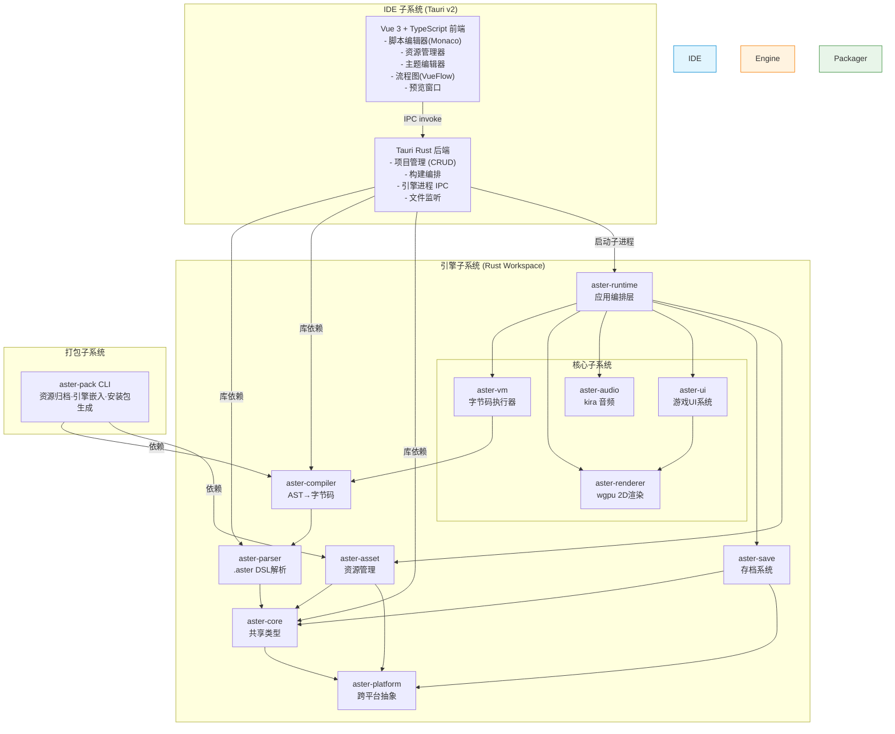
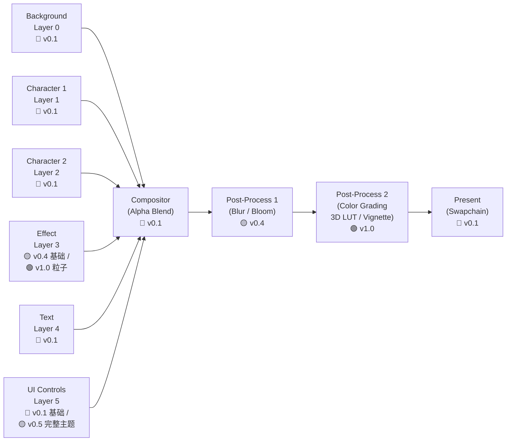
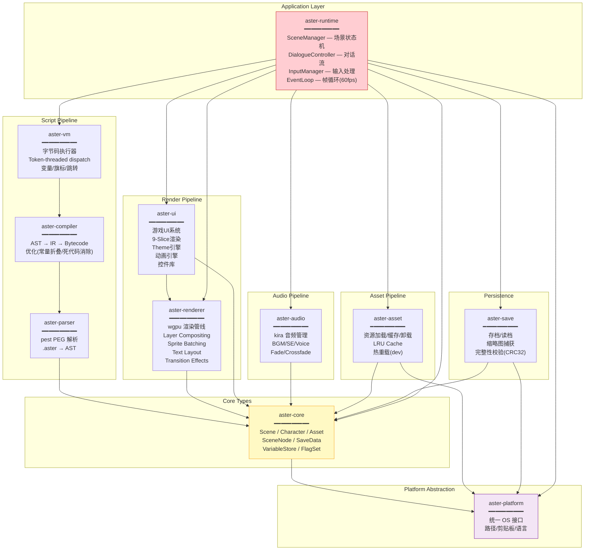
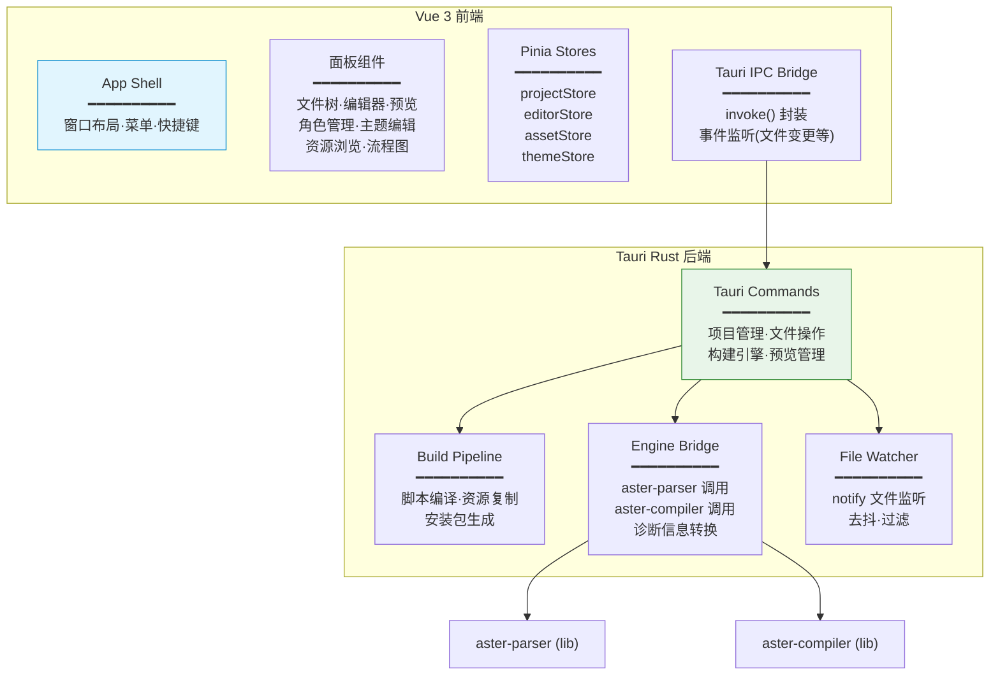
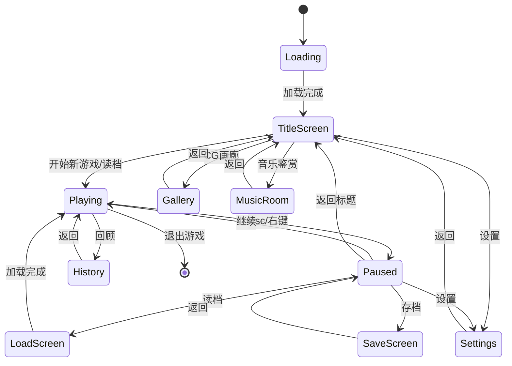
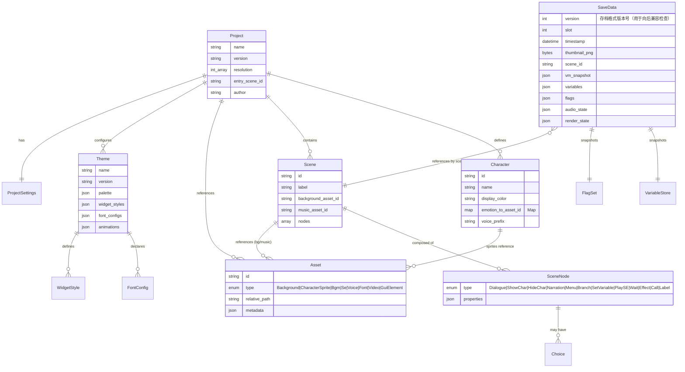
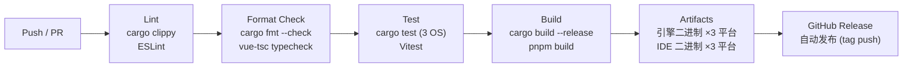

# Asterism（群星）— 项目架构设计文档

> **文档版本**：v1.0
> **创建日期**：2026-06-12
> **最后修改**：2026-06-12
> **作者**：Claude (AI)
> **上游文档**：[Solution.md](./Solution.md) → [Requirements.md](./Requirements.md)
> **关联文档**：[Roadmap.md](./Roadmap.md)

---

## 1. 架构概述

### 1.1 总体架构风格

Asterism 采用 **模块化单体仓库（Modular Monorepo）+ 分层架构（Layered Architecture）** 风格：

- **引擎层**：Rust workspace 中的多个独立 crate，按职责垂直分层。每层通过 trait 定义接口，实现编译期依赖反转
- **IDE 层**：Tauri v2 架构，Rust 后端 + Vue 3 Web 前端。后端以库形式依赖引擎 crate
- **打包层**：独立的 CLI 工具 crate，支持引擎二进制嵌入和资源归档



### 1.2 架构选型理由

| 决策 | 选择 | 替代方案 | 选择理由 |
|------|------|---------|---------|
| 开发模式 | 模块化单体仓库 | 微服务 / 独立仓库 | 引擎 crate 之间紧密耦合但需独立测试；单体仓库保证版本一致 |
| 架构风格 | 分层架构 | ECS / 事件驱动 | 视觉小说是状态机驱动场景，非大量实体交互；分层架构直观且易理解 |
| 依赖注入 | Trait Object | 泛型静态分发 / DI 容器 | Trait Object 提供运行时多态和模拟测试能力（如 MockPlatform） |
| 引擎-IDE 通信 | 库依赖 + 子进程 IPC | HTTP 服务 / WebSocket | 代码期用库（性能好），运行期用进程隔离（不互相阻塞） |
| 脚本执行 | 字节码 VM | 直接 AST 遍历 / Lua 嵌入 | 字节码执行快、可序列化为存档快照、确定性执行 |

### 1.3 关键设计原则

1. **关注点分离**：每个 crate 有唯一职责。渲染器不处理音频，解析器不关心资源管理
2. **依赖倒置**：上层依赖 trait（如 `Renderer` trait），下层实现 trait。便于测试和替换
3. **编译期安全保障**：充分利用 Rust 类型系统。资源 ID 使用 newtype 模式（`AssetId(u64)`），避免混淆
4. **零成本抽象**：热点路径（渲染循环、VM 执行）避免虚函数调用，使用泛型或 enum dispatch
5. **可观测性优先**：所有 crate 集成 `tracing`，关键操作有结构化日志和 span

---

## 2. 技术栈详细说明

### 2.1 引擎语言：Rust（2024 Edition）

| 属性 | 说明 |
|------|------|
| **版本** | Rust 1.95+（使用 2024 edition） |
| **编译目标** | `x86_64-pc-windows-msvc` / `x86_64-apple-darwin` / `aarch64-apple-darwin` / `x86_64-unknown-linux-gnu` |
| **包管理** | Cargo workspace，各 crate 独立 `Cargo.toml` |
| **主要依赖** | wgpu, winit, kira, serde, rmp-serde, toml, pest, tracing, thiserror, anyhow |
| **错误处理** | 库 crate 用 `thiserror` 定义结构化错误；应用层用 `anyhow` 简化传播 |
| **异步** | 引擎侧同步（帧驱动事件循环）；IDE 后端用 `tokio`（Tauri 需要） |
| **Lint** | `clippy::all` + `clippy::pedantic` + `clippy::nursery` |
| **格式化** | `rustfmt`（默认配置） |

**替代方案对比**：

| 方案 | 优点 | 缺点 | 结论 |
|------|------|------|------|
| C++ | 游戏行业标准、库丰富 | 内存安全差、构建系统碎片化、跨平台成本高 | ❌ 不选 |
| C# (.NET) | 生态好、开发效率高 | JIT 冷启动延迟、跨平台 GUI 弱、运行时体积大 | ❌ 不选 |
| Python | Ren'Py 在用、易上手 | 性能不足、GIL、打包分发复杂 | ❌ 不选 |
| **Rust** | 性能极致、安全、跨平台编译、wgpu 生态 | 学习曲线陡、编译慢 | ✅ 最优 |

### 2.2 IDE 框架：Tauri v2 + Vue 3

| 属性 | 说明 |
|------|------|
| **Tauri 版本** | 2.x（stable） |
| **前端框架** | Vue 3（`<script setup>` + Composition API） |
| **语言** | TypeScript 5.x（strict mode） |
| **构建** | Vite 6.x |
| **状态管理** | Pinia |
| **UI 组件库** | PrimeVue 4.x（Aura 主题，无预设样式冲突） |
| **脚本编辑器** | Monaco Editor（`monaco-editor` npm 包，Vue 集成） |
| **流程图** | `@vue-flow/core` |
| **包管理** | pnpm 10.x |
| **Lint** | ESLint + Prettier |
| **测试** | Vitest（单元） + Playwright（E2E） |

**替代方案对比**：

| 方案 | 优点 | 缺点 | 结论 |
|------|------|------|------|
| Electron | 成熟、生态大 | 体积大（~150MB）、内存占用高 | ❌ 不选 |
| Qt/QML | 原生性能 | 绑定复杂、C++ 心智负担、编辑器组件少 | ❌ 不选 |
| Flutter | 跨平台 | Dart 生态缺少成熟代码编辑器组件 | ❌ 不选 |
| **Tauri + Vue 3** | 轻量(~5MB)、Rust后端、Vue生态 | Tauri 较新、API 可能变动 | ✅ 最优 |

### 2.3 游戏脚本：.aster DSL

| 属性 | 说明 |
|------|------|
| **语法风格** | 声明式、缩进敏感、贴近自然语言 |
| **解析器** | pest（PEG 解析器生成器） |
| **AST** | 枚举类型，每个节点携带源码位置信息（span） |
| **IR** | 扁平化中间表示（无嵌套表达式，全部转为寄存器操作） |
| **字节码** | 定长操作码，1 byte op + N bytes operands，约 50 个操作码 |
| **VM** | 基于 token-threaded dispatch（computed goto），寄存器式 |
| **文件扩展名** | `.aster`（源码） / `.asterbyte`（编译后） |

**.aster DSL 语法示例**：

```aster
-- 这是注释
scene "chapter1/prologue" {
    description: "序章 - 相遇"

    bg "bg_school_courtyard"
    music "bgm_daily_life" fade_in: 2.0

    show sayori at center with fade(0.5)

    sayori "今天天气真好啊。"
    show sayori emotion: "smile" with dissolve(0.3)
    sayori "要不要一起去散步？"

    menu "去哪里？" {
        "樱花大道" {
            $route_sakura = true
            jump "chapter1/sakura_road"
        }
        "图书馆" {
            $route_library = true
            jump "chapter1/library"
        }
        "哪里都不去" if $affection_sayori >= 3 {
            sayori "诶——好冷淡..."
            jump "chapter1/stay"
        }
    }
}
```

### 2.4 渲染后端：wgpu + 自定义 2D 管线

| 属性 | 说明 |
|------|------|
| **GPU 抽象** | wgpu 23.x（映射到 Vulkan 1.3 / DirectX 12 / Metal 3） |
| **窗口** | winit 0.30+ |
| **着色器语言** | WGSL（WebGPU Shading Language） |
| **渲染管线** | 自定义 2D：Layer-based compositing → Post-processing → Present |
| **文本渲染** | cosmic-text（GPU 加速的文本布局和光栅化） |
| **纹理压缩** | PNG 运行时→ RGBA8 纹理。未来支持 basis-universal（v1.0.0） |

**渲染管线架构**（标注各 Layer / Pass 的引入阶段）：



| 图例 | 含义 |
|------|------|
| 🔵 v0.1~v0.3 | 基础实现（引擎脚本→渲染管线 + IDE MVP） |
| 🟡 v0.4~v0.5 | 增强实现（转场/语音/主题/流程图等） |
| 🟢 v1.0.0 | 完整实现（Live2D/粒子/Steam/插件等） |

> **设计原则**：渲染管线从 v0.1.0 起就预留全部 6 个 Layer 和 2 个 Post-Process Pass 的管线架构。v0.1~v0.3 阶段，Layer 3（Effect）和 Post-Process Pass 为"空操作"（passthrough），仅传递帧缓冲不做处理；v0.4~v0.5 和 v1.0.0 逐步激活对应阶段的实际 Shader 逻辑。这避免了后续重构管线拓扑。

### 2.5 音频后端：kira

| 属性 | 说明 |
|------|------|
| **框架** | kira 0.9+ |
| **音频解码** | symphonia（OGG/FLAC/WAV/MP3 全格式支持） |
| **混音组** | 3 组：BGM（循环）、SE（一次性）、Voice（流式） |
| **能力** | Tweening（fade in/out）、播放速度控制、音量/静音、Clock 同步 |
| **格式** | 推荐 OGG Vorbis（BGM/Voice）、OGG/WAV（SE） |

### 2.6 数据序列化与存储

| 用途 | 格式 | 库 |
|------|------|-----|
| 项目配置 | TOML | `toml` crate |
| 游戏存档 | MessagePack（二进制） | `rmp-serde` |
| 存档缩略图 | PNG（嵌入 MessagePack 的 bytes 字段） | `image` crate |
| 编译后脚本 | 自定义二进制 `.asterbyte` | `bincode` |
| 资源归档（v1.0.0） | ZIP + AES-256-GCM | `zip` + `aes-gcm` |

---

## 3. 系统架构图

### 3.1 引擎运行时拓扑



### 3.2 IDE 架构



---

## 4. 模块/组件设计

### 4.1 `aster-platform` — 跨平台抽象层

| 属性 | 说明 |
|------|------|
| **职责** | 统一封装三个桌面平台的系统级差异 |
| **依赖** | 无外部依赖（仅 std） |
| **对外接口** | `Platform` trait（见下方） |
| **平台实现** | 条件编译：`#[cfg(target_os)]` → WindowsPlatform / MacOSPlatform / LinuxPlatform |
| **对应需求** | NFR-COMPAT-001 ~ 003 |

```rust
/// 跨平台抽象 trait - 所有引擎模块通过此接口获取平台能力
pub trait Platform: Send + Sync {
    /// 获取用户配置目录
    /// - Windows: %APPDATA%/Asterism/
    /// - macOS: ~/Library/Application Support/com.asterism.engine/
    /// - Linux: ~/.local/share/asterism/
    fn user_config_dir(&self) -> PathBuf;

    /// 获取默认存档目录
    fn default_save_dir(&self, game_name: &str) -> PathBuf;

    /// 路径规范化（统一为 / 分隔符）
    fn normalize_path(&self, raw: &OsStr) -> PathBuf;

    /// 系统剪贴板操作
    fn clipboard_copy(&self, text: &str);
    fn clipboard_paste(&self) -> Option<String>;

    /// 系统语言（返回 BCP 47 标签，如 "zh-CN", "ja-JP"）
    fn system_language(&self) -> LanguageTag;

    /// 单实例锁（防止同一个游戏被多次打开）
    fn try_acquire_single_instance(&self, app_id: &str) -> bool;

    /// 启动外部进程
    fn launch_process(&self, executable: &Path, args: &[&str]) -> Result<Child, PlatformError>;
}
```

### 4.2 `aster-core` — 共享类型定义

| 属性 | 说明 |
|------|------|
| **职责** | 定义引擎所有模块共享的数据类型、枚举、trait 接口 |
| **依赖** | `aster-platform`（仅类型引用）、serde |
| **对应需求** | REQ-ENG-003（变量系统）、REQ-ENG-022（选择支）、数据模型全部实体 |

**核心类型清单**：

| 类型 | 说明 | 关键字段 |
|------|------|---------|
| `Project` | 游戏项目元数据 | name, version, resolution, entry_scene, characters, scenes, settings |
| `Character` | 角色定义 | id, name, display_color, sprites: Map<Emotion, AssetId>, voice_prefix |
| `Scene` | 场景定义 | id, label, background, music, nodes: Vec<SceneNode> |
| `SceneNode` | 场景节点枚举 | Dialogue / ShowChar / HideChar / Narration / Menu / Branch / SetVariable / PlaySE / Wait / Effect / Call / Return / Label |
| `AssetId` | 资源标识符 | newtype u64，按类型分段分配 |
| `Asset` | 资源元数据 | id, asset_type: AssetType, path, metadata |
| `AssetType` | 资源类型枚举 | Background / CharacterSprite / Bgm / Se / Voice / Font / Video / GuiElement |
| `VariableStore` | 变量存储 | HashMap<String, Value>，Value 为 Int / Float / String / Bool / Array / Map |
| `FlagSet` | 旗标集合 | HashSet<String> |
| `SaveData` | 存档数据结构 | slot, timestamp, thumbnail, scene_id, vm_snapshot, variable_store, flags, audio_state, render_state |
| `Theme` | 主题配置 | 完整映射 theme.toml 所有字段的结构体 |

### 4.3 `aster-parser` — DSL 解析器

| 属性 | 说明 |
|------|------|
| **职责** | 将 `.aster` 源码解析为 AST（抽象语法树） |
| **依赖** | `aster-core`、pest |
| **输入** | `.aster` 文件内容（&str） |
| **输出** | `Result<ParsedScene, Vec<ParseError>>` |
| **对应需求** | REQ-ENG-001（DSL 脚本解析）、REQ-DSL-001~003 |

```
解析流程：
.aster 源码 → pest::Parser (PEG 语法) → PestToken 流 → AST Builder → ParsedScene

ParseError 包含：
- location: (line, column, offset)
- message: 错误描述（中文，如 "第3行第12列：未闭合的字符串字面量"）
- hint: 修复建议（如 "是否漏掉了右引号 \" ？"）
- context: 出错行的源代码文本
```

### 4.4 `aster-compiler` — 字节码编译器

| 属性 | 说明 |
|------|------|
| **职责** | AST → 中间表示（IR）→ 字节码，包含优化 Pass |
| **依赖** | `aster-core`、`aster-parser`、bincode |
| **输入** | `ParsedScene` |
| **输出** | `Result<CompiledScene, Vec<CompileError>>` |
| **对应需求** | REQ-ENG-002（字节码编译） |

**优化 Pass**：
1. Constant Folding — `$x = 2 + 3` → `$x = 5`
2. Dead Label Elimination — 移除不可达的标签
3. Jump Threading — 连续的 jump 合并
4. Peephole — 相邻指令优化

**字节码指令集（部分）**：

| Opcode | 助记符 | 操作数 | 说明 |
|--------|--------|--------|------|
| 0x01 | `PUSH_STR` | reg, str_idx | 将字符串常量压入寄存器 |
| 0x02 | `PUSH_INT` | reg, i32 | 将整型压入寄存器 |
| 0x10 | `BG` | asset_idx, transition | 更换背景 |
| 0x11 | `SHOW` | char_idx, emotion_idx, pos, transition | 显示角色 |
| 0x12 | `HIDE` | char_idx, transition | 隐藏角色 |
| 0x20 | `DIALOGUE` | speaker_idx, text_idx, voice_idx | 显示对话 |
| 0x21 | `NARRATE` | text_idx | 显示旁白 |
| 0x30 | `MENU` | choices_ptr | 显示选择支 |
| 0x40 | `JUMP` | label_idx | 无条件跳转 |
| 0x41 | `JUMP_IF` | reg, label_idx | 条件为真跳转 |
| 0x42 | `JUMP_IF_FLAG` | flag_idx, label_idx | 旗标为真跳转 |
| 0x50 | `SET_VAR` | name_idx, value_reg | 设置变量 |
| 0x51 | `SET_FLAG` | flag_idx | 设置旗标 |
| 0x60 | `PLAY_BGM` | asset_idx, fade_in | 播放 BGM |
| 0x61 | `PLAY_SE` | asset_idx | 播放音效 |
| 0x62 | `PLAY_VOICE` | asset_idx | 播放语音 |
| 0xF0 | `WAIT` | duration_ms | 等待 |
| 0xFF | `END` | — | 场景结束 |

### 4.5 `aster-vm` — 字节码执行器

| 属性 | 说明 |
|------|------|
| **职责** | 执行字节码指令，维护 VM 状态（PC、寄存器、栈） |
| **依赖** | `aster-core`、`aster-compiler` |
| **输入** | `CompiledScene` + VM 上下文（变量/旗标） |
| **输出** | 通过回调向 SceneManager 发送命令 |
| **对应需求** | REQ-ENG-002、REQ-ENG-003 |

**VM 架构**：寄存器式、基于 computed goto 的 token-threaded dispatch。

```rust
pub struct Vm {
    pc: usize,                    // 程序计数器（指向当前指令）
    // v0.1~v0.3: 16 个寄存器足够支撑基础表达式（变量读写、简单条件、旗标操作）
    // v0.4 (REQ-DSL-003): 表达式增强后（算术运算、字符串拼接、三元运算符、数组/映射字面量），
    //   评估是否需扩展为 32 个寄存器或引入栈式混合模型（栈顶缓存 + 寄存器文件）
    registers: [Value; 16],       // 通用寄存器
    stack: Vec<Value>,            // 操作数栈（v0.1~v0.3 用于子例程参数传递；v0.4 表达式增强后承载复杂表达式中间值）
    variables: VariableStore,     // 全局变量
    flags: FlagSet,               // 全局旗标
    call_stack: Vec<CallFrame>,   // 子例程调用帧
}

impl Vm {
    /// 执行下一条指令。返回需要 Runner 处理的 Action。
    pub fn step(&mut self, bytecode: &CompiledScene) -> VmAction {
        // token-threaded dispatch via computed goto
    }
}
```

**回调模型**：VM 不直接操作渲染/音频，而是通过 `VmAction` 枚举返回"意图"：

```rust
pub enum VmAction {
    /// 需要等待用户输入（点击/按键）
    WaitForInput,
    /// 显示选择支，等待用户选择
    ShowMenu { choices: Vec<Choice> },
    /// 暂停执行指定时长
    Sleep { duration: Duration },
    /// 场景结束
    SceneEnd,
    /// 引擎命令（传递给 SceneManager）
    Command(EngineCommand),
}
```

### 4.6 `aster-renderer` — GPU 渲染器

| 属性 | 说明 |
|------|------|
| **职责** | 管理 wgpu 设备、渲染管线、图层合成、文本渲染、转场特效 |
| **依赖** | `aster-core`、`aster-asset`、wgpu、winit、cosmic-text |
| **对应需求** | REQ-ENG-010~014、REQ-ENG-050~052 |

**渲染器内部组件**：

| 组件 | 职责 |
|------|------|
| `GpuContext` | wgpu 设备/适配器/队列/表面初始化与管理 |
| `SpriteBatcher` | 每帧收集所有 Sprite 绘制命令，合并为单次 Draw Call |
| `LayerManager` | 管理 6 个渲染层的创建、排序、混合模式 |
| `TextRenderer` | 使用 cosmic-text 生成文本 mesh，管理字形图集 |
| `TransitionEngine` | 转场效果状态机（crossfade/slide/dissolve/wipe） |
| `PostProcessor` | 后期处理（blur/bloom→v0.4，color grading/vignette→v1.0） |
| `FrameCapture` | 从当前帧缓冲区读取像素数据（用于存档缩略图） |

### 4.7 `aster-audio` — 音频系统

| 属性 | 说明 |
|------|------|
| **职责** | 管理 kira 音频引擎，多通道混音，淡入淡出 |
| **依赖** | `aster-core`、`aster-asset`、kira |
| **对应需求** | REQ-ENG-030~032、REQ-ENG-060~062 |

```rust
pub struct AudioSystem {
    manager: AudioManager,
    bgm_track: Option<Handle<StaticSoundData>>,
    se_channel: MixerHandle,
    voice_channel: MixerHandle,
    volumes: AudioVolumes,
    // 当前正在播放的 BGM 信息（用于存档恢复）
    current_bgm: Option<(AssetId, f64)>,  // (asset_id, position_secs)
}
```

### 4.8 `aster-ui` — 游戏 UI 系统

| 属性 | 说明 |
|------|------|
| **职责** | 游戏内 UI 控件的渲染、主题管理、动画引擎、9-Slice 缩放 |
| **依赖** | `aster-core`、`aster-renderer`（通过 trait 接口） |
| **对应需求** | REQ-UI-001~005、REQ-ENG-078 |

**UI 控件树**：

| 控件 | 说明 | 主题配置路径 |
|------|------|-------------|
| `TextBox` | 对话文本显示框 | `[theme.textbox]` |
| `NamePlate` | 说话者铭牌 | `[theme.textbox.nameplate]` |
| `ChoiceButton` | 选择支按钮 | `[theme.choices]` |
| `SaveLoadPanel` | 存档/读档界面 | `[theme.save_load]` |
| `SettingsPanel` | 设置界面 | `[theme.settings_panel]` |
| `Slider` | 设置滑块（文字速度/音量等） | `[theme.settings_panel.slider]` |
| `Toggle` | 设置开关 | `[theme.settings_panel.toggle]` |
| `HistoryPanel` | 历史回顾 | `[theme.history]` |
| `CGGallery` | CG 画廊 | `[theme.cg_gallery]` |
| `MusicRoom` | 音乐鉴赏 | `[theme.music_room]` |
| `TitleScreen` | 标题画面 | `[theme.title]` |
| `TransitionOverlay` | 过场提示 | `[theme.transition]` |

**动画引擎**：

```rust
pub enum AnimCurve {
    Linear,
    EaseIn, EaseOut, EaseInOut,
    Spring { damping: f32, stiffness: f32 },
    CubicBezier { p1: (f32, f32), p2: (f32, f32) },
    Anticipate, Overshoot, Bounce,
}

pub struct AnimState {
    curve: AnimCurve,
    duration: Duration,
    elapsed: Duration,
    start_value: f32,
    end_value: f32,
}
```

### 4.9 `aster-asset` — 资源管理

| 属性 | 说明 |
|------|------|
| **职责** | 资源发现、加载、缓存、卸载生命周期管理 |
| **依赖** | `aster-core`、`aster-platform`、image crate、symphonia |
| **对应需求** | REQ-ENG-011、REQ-IDE-020 |

```rust
pub struct AssetManager {
    base_path: PathBuf,
    cache: LruCache<AssetId, Arc<LoadedAsset>>,
    loaders: HashMap<AssetType, Box<dyn AssetLoader>>,
    // 资源引用计数（GPU 纹理等重量资源）
    ref_counts: HashMap<AssetId, usize>,
}

pub enum LoadedAsset {
    Texture { handle: wgpu::Texture, size: (u32, u32) },
    AudioData { samples: Vec<f32>, sample_rate: u32 },
    Bytes { data: Vec<u8> },
}
```

### 4.10 `aster-save` — 存档系统

| 属性 | 说明 |
|------|------|
| **职责** | 游戏状态快照、序列化/反序列化、缩略图生成、完整性校验 |
| **依赖** | `aster-core`、`aster-platform`、rmp-serde、image |
| **对应需求** | REQ-ENG-040~042、REQ-ENG-070~072 |

```rust
pub struct SaveManager {
    save_dir: PathBuf,
    quick_slot: usize,      // F5 快速存档槽位
    auto_slot: usize,       // 自动存档槽位
    max_slots: usize,       // 最大槽位数（默认 30）
}

impl SaveManager {
    pub fn save(&self, slot: usize, state: &GameState) -> Result<SaveMetadata, SaveError>;
    pub fn load(&self, slot: usize) -> Result<GameState, SaveError>;
    pub fn list_saves(&self) -> Vec<SaveSlotInfo>;
    pub fn delete_save(&self, slot: usize) -> Result<(), SaveError>;
}
```

**存档格式版本化与迁移策略**（对应 NFR-COMPAT-006）：

`SaveData` 中嵌入 `version: u32` 字段。写入存档时使用当前引擎版本号；读取时按版本分流：

```
读取存档 → 检查 version 字段
├─ version == CURRENT → 直接反序列化
├─ version in MIGRATION_MAP → 执行迁移函数链（version+1 → ... → CURRENT）
│   例: v1 → v2 迁移: 新增字段使用默认值填充
│       v2 → v3 迁移: 变量存储格式从 HashMap 改为 BTreeMap（有序化以支持差分存档）
└─ version ∉ MIGRATION_MAP && version < MIN_SUPPORTED → 返回 SaveError::IncompatibleVersion {
        found, min_supported, hint: "请使用 v{x}.x 版本引擎打开此存档"
   }
```

迁移函数注册表：
```rust
type MigrationFn = fn(&[u8]) -> Result<Vec<u8>, SaveError>;
static SAVE_MIGRATIONS: Lazy<BTreeMap<u32, MigrationFn>> = Lazy::new(|| {
    // 版本号 → 迁移到下一版本的函数
    // BTreeMap::new()  // 初始为空，随引擎升级逐步添加
});
```

### 4.11 `aster-runtime` — 运行时应用层

| 属性 | 说明 |
|------|------|
| **职责** | 游戏事件循环、SceneManager 编排、各子系统协调 |
| **依赖** | 所有引擎 crate |
| **对应需求** | REQ-ENG-020~023、REQ-ENG-073~074 |

**核心状态机**：



### 4.12 需求覆盖映射

| 模块 | 覆盖的需求编号 |
|------|--------------|
| `aster-platform` | NFR-COMPAT-001~003 |
| `aster-core` | REQ-ENG-003, 数据模型全部 |
| `aster-parser` | REQ-ENG-001, REQ-DSL-001~003 |
| `aster-compiler` | REQ-ENG-002 |
| `aster-vm` | REQ-ENG-002, REQ-ENG-003, REQ-ENG-023 |
| `aster-renderer` | REQ-ENG-010~014, REQ-ENG-050~052, NFR-PERF-001~002 |
| `aster-audio` | REQ-ENG-030~032, REQ-ENG-060~062 |
| `aster-ui` | REQ-UI-001~005, REQ-ENG-078 |
| `aster-asset` | REQ-ENG-011, REQ-IDE-020~021 |
| `aster-save` | REQ-ENG-040~042, REQ-ENG-070~072, NFR-SEC-003 |
| `aster-runtime` | REQ-ENG-020~023, REQ-ENG-073~075 |
| IDE 后端 | REQ-IDE-001~003, REQ-IDE-020~023, REQ-IDE-030~036 |
| IDE 前端 | REQ-IDE-010~011, REQ-IDE-030~036 |

---

## 5. 数据架构

### 5.1 ER 图



### 5.2 游戏项目磁盘布局

```
my_galgame/                              # 项目根目录
├── project.toml                         # 项目元数据 (TOML)
├── theme.toml                           # UI 主题配置 (TOML)
│
├── scripts/                             # .aster 脚本源码
│   ├── prologue.aster
│   ├── chapter_*.aster
│   └── common.aster
│
├── characters/                          # 角色定义
│   ├── heroine_a.asterchar
│   └── heroine_b.asterchar
│
├── assets/                              # 原始游戏资源
│   ├── sprites/                         # 角色立绘
│   ├── backgrounds/                     # 场景背景
│   ├── bgm/                             # 背景音乐 (OGG)
│   ├── se/                              # 音效 (WAV/OGG)
│   ├── voices/                          # 语音 (OGG)
│   ├── video/                           # 视频 (WebM) — v1.0.0
│   └── live2d/                          # Live2D 模型 — v1.0.0
│
├── gui/                                 # UI 皮肤素材 (PNG)
│   ├── textbox.png
│   ├── nameplate.png
│   ├── choice_*.png
│   ├── save_card.png
│   ├── settings_panel.png
│   └── ...
│
├── fonts/                               # 字体文件 (.ttf/.otf)
├── i18n/                                # 多语言文件 — v1.0.0
├── build.toml                           # 构建配置 (TOML)
├── .asterignore                         # 构建排除
│
└── .aster_cache/                         # 构建缓存 (已 gitignore)
    ├── compiled/                        # .asterbyte
    ├── packed/                          # 打包产物
    └── thumbnails/                      # 生成的缩略图
```

**`project.toml` 项目元数据文件格式**（TOML）：

```toml
# project.toml — 游戏项目元数据
# 对应类型：aster_core::Project

[project]
# 项目名称（显示在窗口标题和关于对话框中）
name = "My First Visual Novel"
# 语义化版本号
version = "0.1.0"
# 入口场景 ID（对应 scripts/ 下的 .aster 文件名，不含扩展名）
entry_scene = "prologue"

[project.resolution]
# 游戏设计分辨率（逻辑像素，引擎自动适配实际窗口大小）
width = 1920
height = 1080

[project.settings]
# 默认语言（ISO 639-1 代码，多语言支持 — v1.0.0）
language = "zh-CN"
# 默认文字显示速度（instant / slow / normal / fast）
text_speed = "normal"
# 默认 BGM 音量（0.0 ~ 1.0）
default_bgm_volume = 0.8
# 默认音效音量（0.0 ~ 1.0）
default_se_volume = 1.0
# 默认语音音量（0.0 ~ 1.0）
default_voice_volume = 1.0
```

> `characters` 和 `scenes` 字段由引擎在加载时从 `characters/` 和 `scripts/` 目录自动发现，无需在 `project.toml` 中手动列出。

**`.asterchar` 角色定义文件格式**（TOML）：

```toml
# characters/heroine_a.asterchar
[character]
id = "sayori"
name = "小百合"
display_color = "#F8BBD0"

[character.sprites]
default = "sayori_default.png"
smile = "sayori_smile.png"
angry = "sayori_angry.png"
embarrassed = "sayori_embarrassed.png"
surprise = "sayori_surprise.png"

[character.voice]
prefix = "sayori"        # 语音文件前缀，如 sayori_0001.ogg
```

> `.asterchar` 文件为 TOML 格式，`aster-parser` 提供 `parse_character_file()` 函数解析。角色定义可分散在多个文件中，引擎加载时合并为一个 `Character` 集合。

**`build.toml` 构建配置文件格式**（TOML）：

```toml
# build.toml — 项目构建配置
# 控制脚本编译、资源过滤、归档打包的行为

[compile]
# 编译目标格式：asterbyte（字节码，推荐）或 ast（调试用 AST dump）
target = "asterbyte"
# 开启编译优化（常量折叠、死代码消除、跳转合并、窥孔优化）
optimize = true
# 压缩输出（去除空白和注释）
minify = true

[include]
# 需要包含在构建产物中的文件（glob 模式，相对于项目根目录）
patterns = [
    "assets/**/*",
    "gui/**/*",
    "fonts/**/*",
]

[exclude]
# 构建时排除的文件（glob 模式，优先级高于 include）
patterns = [
    "**/.aster_cache/**",
    "**/*.tmp",
    "**/*.bak",
]

[archive]
# 归档格式：asterarchive（Asterism 资源归档，推荐）或 dir（目录）
format = "asterarchive"
# 是否加密资源文件（AES-256-GCM，正式发布时开启）
encrypt = false
```

> `build.toml` 为 TOML 格式，由 `aster-pack` CLI 和 IDE 构建流程读取。与 `.asterignore` 协同工作——`.asterignore` 列出的是"永远排除"的文件（类似 `.gitignore`），而 `build.toml [exclude]` 列出的是"构建时排除"的文件。

### 5.3 IDE 状态持久化

IDE 用户状态（窗口布局、最近项目列表、编辑器偏好设置等）保存到平台用户配置目录：

```
# 存储位置
Windows: %APPDATA%/Asterism/ide-state.json
macOS:   ~/Library/Application Support/com.asterism.ide/ide-state.json
Linux:   ~/.local/share/asterism/ide-state.json

# 数据结构（JSON）
{
  "version": 1,
  "window": {
    "width": 1600, "height": 900,
    "maximized": true,
    "panel_layout": { "left": 280, "right": 320, "bottom": 200 }
  },
  "recent_projects": [
    { "path": "/home/user/my_galgame", "last_opened": "2026-06-12T10:30:00Z" }
  ],
  "editor": {
    "font_size": 14,
    "tab_size": 2,
    "word_wrap": true,
    "minimap": true
  },
  "preview": {
    "auto_refresh": true,
    "show_debug_overlay": false
  }
}
```

### 5.4 缓存策略

| 缓存层级 | 内容 | 策略 | 大小限制 |
|---------|------|------|---------|
| **纹理缓存** | GPU 纹理句柄（wgpu::Texture） | LRU，按最近使用淘汰 | 默认 256 MB，可由 theme.toml 配置 |
| **字形图集** | 文本渲染字形（cosmic-text 管理） | 自动管理，按需淘汰不活跃尺寸 | 最大 4096×4096 图集 |
| **音频缓冲** | 已解码音频样本 | LRU，预加载下一个场景的 BGM | 默认 128 MB |
| **IDE 资源缩略图** | 图片缩略图（磁盘持久化） | 生成一次缓存到 .aster_cache/thumbnails/ | N/A（磁盘，不占内存） |

### 5.5 数据库选型

**本项目不使用传统数据库**。所有数据以文件形式存储：

| 数据 | 格式 | 理由 |
|------|------|------|
| 项目配置 | TOML 文件 | 人类可读写，VCS 友好 |
| 游戏存档 | MessagePack 二进制（每个槽一个 .sav 文件，含 version 字段） | 紧凑、快速、自描述、版本化 |
| 角色定义 | `.asterchar` TOML 文件 | 与项目配置风格一致，支持分文件管理 |
| 引擎配置 | TOML 文件 | 与项目配置一致 |
| IDE 状态 | JSON 文件（`%APPDATA%/Asterism/ide-state.json` 等平台路径） | 简单、跨平台、不混入项目目录 |

---

## 6. 接口设计

### 6.1 引擎内部接口（Rust Trait）

```rust
/// 渲染器接口 — aster-runtime 通过此 trait 调用渲染功能
#[async_trait]
pub trait Renderer: Send + Sync {
    /// 设置背景图片
    fn set_background(&mut self, asset_id: AssetId, transition: Transition) -> Result<()>;
    /// 显示/更新角色立绘
    fn show_character(&mut self, char: &Character, emotion: Emotion, pos: Position, anim: ShowAnim) -> Result<()>;
    /// 隐藏角色立绘
    fn hide_character(&mut self, char_id: &str, anim: HideAnim) -> Result<()>;
    /// 显示对话文本
    fn show_dialogue(&mut self, speaker: &str, text: &str, voice_id: Option<AssetId>) -> Result<()>;
    /// 显示旁白
    fn show_narration(&mut self, text: &str) -> Result<()>;
    /// 显示选择支
    fn show_menu(&mut self, choices: &[Choice]) -> Result<()>;
    /// 捕获当前帧截图（用于存档缩略图）
    fn capture_screenshot(&self) -> Result<Vec<u8>>;
    /// 渲染一帧
    fn render_frame(&mut self, scene: &SceneState, ui: &UiState) -> Result<()>;
}

/// 音频系统接口
pub trait AudioSystem: Send + Sync {
    fn play_bgm(&mut self, asset_id: AssetId, fade_in: Duration) -> Result<()>;
    fn stop_bgm(&mut self, fade_out: Duration) -> Result<()>;
    fn play_se(&mut self, asset_id: AssetId) -> Result<()>;
    fn play_voice(&mut self, asset_id: AssetId) -> Result<()>;
    fn set_volume(&mut self, channel: AudioChannel, volume: f32) -> Result<()>;
    fn get_state(&self) -> AudioSnapshot;
}
```

### 6.2 IDE Tauri Commands（前端 ↔ 后端 IPC）

```typescript
// 前端调用后端（Vue → Rust via Tauri IPC）

// 项目管理
invoke('create_project', { name: string, path: string, resolution: [number, number] }): Promise<ProjectMeta>
invoke('open_project', { path: string }): Promise<ProjectMeta>
invoke('get_project_info'): Promise<ProjectInfo>

// 文件操作
invoke('read_file', { path: string }): Promise<string>
invoke('write_file', { path: string, content: string }): Promise<void>
invoke('delete_file', { path: string }): Promise<void>
invoke('rename_file', { oldPath: string, newPath: string }): Promise<void>

// 脚本编译
invoke('check_syntax', { source: string }): Promise<Diagnostic[]>
invoke('compile_script', { path: string }): Promise<CompileResult>

// 资源管理
invoke('import_asset', { sourcePath: string, targetDir: string }): Promise<AssetInfo>
invoke('get_asset_thumbnail', { assetId: string }): Promise<Uint8Array>

// 构建
invoke('build_project', { platform: string }): Promise<BuildResult>
invoke('launch_preview'): Promise<void>

// 前置事件（后端 → 前端）
listen('file-changed', (event) => { /* 文件系统变更通知 */ })
listen('build-log', (event) => { /* 构建过程日志 */ })
listen('preview-log', (event) => { /* 预览引擎日志 */ })
```

### 6.3 引擎预览 IPC（IDE ↔ Engine 子进程）

IDE 启动引擎子进程时指定预览模式：

```bash
aster-runtime --preview --project /path/to/project --ipc-pipe "aster_preview_pipe"
```

IPC 通道（Unix domain socket / Windows named pipe）传递 JSON 消息：

```json
// IDE → Engine
{ "type": "load_scene", "scene_id": "chapter1/prologue" }
{ "type": "set_variable", "name": "debug_skip", "value": true }
{ "type": "reload_scripts" }

// Engine → IDE
{ "type": "frame_stats", "fps": 60.0, "frame_time_ms": 2.3 }
{ "type": "scene_loaded", "scene_id": "chapter1/prologue", "load_time_ms": 450 }
{ "type": "error", "message": "Missing asset: bg_school_night" }
```

---

## 7. 安全架构

### 7.1 认证与授权

Asterism 作为本地运行的桌面引擎，不涉及网络认证。安全重点在于：

- **脚本沙箱**：.aster 脚本无文件系统写权限、无网络权限、无进程启动权限
- **WASM 插件沙箱**（v1.0.0）：基于 Wasmtime，通过 WASI 最小权限集运行
- **资源校验**：IDE 导入文件时检查文件魔数（magic bytes），拒绝可执行文件

### 7.2 数据保护

```
保存流程：
GameState → serde Serialize → rmp_serde::to_vec → CRC32 校验和 → 写入 .sav 文件

加载流程：
读取 .sav 文件 → 分离数据和校验和 → 重新计算 CRC32 → 比对校验和
  ├─ 一致 → rmp_serde::from_slice → GameState
  └─ 不一致 → 返回 SaveError::Corrupted("存档文件已损坏")
```

### 7.3 敏感信息

- 引擎不收集遥测数据
- 无硬编码密钥
- .asterarchive 的 AES-GCM 密钥来自创作者口令（PBKDF2 派生），非引擎保管
- IDE 不连接任何外部服务

---

## 8. 部署架构

### 8.1 CI/CD 流水线



**GitHub Actions 矩阵构建**：

```yaml
strategy:
  fail-fast: false
  matrix:
    os: [ubuntu-latest, windows-latest, macos-latest]
```

### 8.2 游戏分发形态

**开发阶段**（创作者）：
```
IDE 项目目录 → 本地预览运行
```

**发布阶段**（玩家）：
```
.aster 脚本 → aster-compiler → .asterbyte
资源文件 → aster-pack → data.asterarchive
引擎二进制 + data.asterarchive → 平台安装包
```

**安装包格式**：

| 平台 | 格式 | 工具 |
|------|------|------|
| Windows | NSIS 安装器 (.exe) | Tauri CLI |
| macOS | DMG 磁盘映像 | Tauri CLI |
| Linux | AppImage / .deb | Tauri CLI |

### 8.3 开发环境搭建

**前置依赖**：

| 工具 | 版本要求 | 用途 |
|------|---------|------|
| Rust | ≥ 1.95.0 | 引擎编译 |
| Node.js | ≥ 20.x | IDE 前端开发 |
| pnpm | ≥ 9.x | 前端包管理 |
| Cargo | 随 Rust | crate 管理 |
| Git | ≥ 2.40 | 版本控制 |

**快速开始**：
```bash
# 克隆仓库
git clone https://github.com/asterism-engine/asterism.git
cd asterism

# 构建引擎（根 Cargo.toml 为 workspace 入口）
cargo build --workspace --release

# 启动 IDE（开发模式）
cd ide
pnpm install
pnpm tauri dev

# 运行完整测试（回到根目录）
cd ..
cargo test --workspace
pnpm --dir ide test
```

---

*本文档定义了 Asterism 的完整技术架构。开发路线图请参阅 [Roadmap.md](./Roadmap.md)。*
