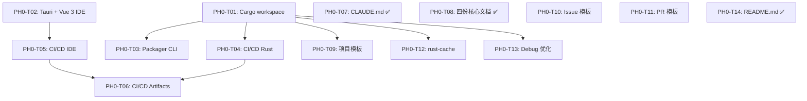

# Phase 0 — 项目初始化 任务清单

> **对应路线图**：[Roadmap.md](./Roadmap.md) 中 Phase 0 章节
> **里程碑目标**：建立完整的开发基础设施，确保后续所有 Phase 的编码工作能高效、一致、自动化地进行
> **覆盖需求**：NFR-MAIN-001, NFR-MAIN-002, NFR-MAIN-007, NFR-MAIN-008, NFR-COMPAT-001~003
> **预估总工时**：44 小时（已完成 22 小时，剩余 22 小时）
> **生成时间**：2026-06-12 22:00
> **最后更新**：2026-06-13 08:00

---

## 📋 任务总览

| 编号 | 任务名称 | 优先级 | 预估工时 | 依赖 | 状态 |
|------|----------|--------|----------|------|------|
| PH0-T01 | 初始化 Cargo workspace | P0 | 2h | 无 | [x] |
| PH0-T02 | 初始化 Tauri + Vue 3 IDE 项目 | P0 | 4h | 无 | [x] |
| PH0-T03 | 初始化 packager CLI crate | P1 | 2h | PH0-T01 | [x] |
| PH0-T04 | CI/CD — Rust（lint + test + build 3 平台矩阵） | P0 | 4h | PH0-T01 | [x] |
| PH0-T05 | CI/CD — IDE（lint + typecheck + test + build + IDE 编译） | P0 | 2h | PH0-T02 | [x] |
| PH0-T06 | CI/CD — Artifacts 上传 | P1 | 2h | PH0-T04, PH0-T05 | [x] |
| PH0-T07 | 编写 CLAUDE.md（编码规范 + Git 规范 + 注释规范） | P0 | 4h | 无 | [x] |
| PH0-T08 | 编写四份核心文档（Solution / Requirements / Architecture / Roadmap） | P0 | 16h | 无 | [x] |
| PH0-T09 | 创建示例项目模板 | P1 | 2h | PH0-T01 | [x] |
| PH0-T10 | 搭建 GitHub Issue 模板 | P1 | 1h | 无 | [x] |
| PH0-T11 | 搭建 GitHub PR 模板 | P1 | 0.5h | 无 | [x] |
| PH0-T12 | 配置编译缓存加速 | P1 | 2h | PH0-T01 | [x] |
| PH0-T13 | 配置 debug 编译优化 | P1 | 0.5h | PH0-T01 | [x] |
| PH0-T14 | 创建/完善 README.md | P0 | 2h | 无 | [x] |

**统计**：总计 14 个任务 | 已完成: 14 | 进行中: 0 | 待开始: 0

---

## 📐 依赖关系图



> **关键路径**：PH0-T01 → PH0-T04 → PH0-T06（最长串行链，仅 3 层，风险低）
>
> **可并行启动（4 个无依赖任务）**：PH0-T01, PH0-T02, PH0-T10, PH0-T11

---

## 📝 详细任务列表

### PH0-T01 — 初始化 Cargo workspace

| 属性 | 内容 |
|------|------|
| **优先级** | P0 |
| **预估工时** | 2 小时 |
| **对应需求** | NFR-MAIN-008（依赖最小化） |
| **对应架构模块** | `engine/`（Rust workspace，参考 Architecture.md §4） |
| **前置依赖** | 无 |
| **状态** | [x] 已完成 |

#### 任务说明

1. **开发目标**：创建 Rust workspace 根 `Cargo.toml` 和全部 11 个 engine crate 的目录骨架，确保 `cargo build --workspace` 能通过（哪怕每个 crate 只有一个空的 `lib.rs`）。

2. **涉及文件/组件**（workspace 根 + 11 个 crate，但属于同一模式）：
   - 新建：`engine/Cargo.toml` — workspace 根 manifest，声明全部 11 个 member
   - 新建：`engine/aster-platform/Cargo.toml` + `src/lib.rs`
   - 新建：`engine/aster-core/Cargo.toml` + `src/lib.rs`
   - 新建：`engine/aster-parser/Cargo.toml` + `src/lib.rs`
   - 新建：`engine/aster-compiler/Cargo.toml` + `src/lib.rs`
   - 新建：`engine/aster-vm/Cargo.toml` + `src/lib.rs`
   - 新建：`engine/aster-renderer/Cargo.toml` + `src/lib.rs`
   - 新建：`engine/aster-audio/Cargo.toml` + `src/lib.rs`
   - 新建：`engine/aster-asset/Cargo.toml` + `src/lib.rs`
   - 新建：`engine/aster-save/Cargo.toml` + `src/lib.rs`
   - 新建：`engine/aster-ui/Cargo.toml` + `src/lib.rs`
   - 新建：`engine/aster-runtime/Cargo.toml` + `src/lib.rs`

3. **实现要点**：
   - workspace 根 `Cargo.toml` 使用 `[workspace]` 段声明 members，使用 `[workspace.dependencies]` 统一管理版本号
   - 每个 crate 的 `Cargo.toml` 只需声明 name / version / edition（2024）/ description / license（MIT）/ 空的 `[dependencies]`
   - 每个 crate 的 `lib.rs` 初始内容：文件头注释（按 CLAUDE.md §4.1 规范）+ 一个占位测试 `#[test] fn it_works() {}`
   - 各 crate 之间的依赖关系在 `Cargo.toml` 中暂不声明（Phase 1 实际开发时再添加）
   - `aster-platform` 的 `[dependencies]` 应为空（仅 std，符合 Architecture.md §4.1）
   - `aster-core` 的 `[dependencies]` 包含 `serde = { workspace = true, features = ["derive"] }`
   - Crate 命名使用 `kebab-case`（CLAUDE.md §2.1.1）

4. **关联上下文**：
   - 架构依据（Architecture.md §4）：各 crate 职责定义
   - Workspace 分层结构：`aster-platform` ← `aster-core` ← `aster-parser` ← `aster-compiler` ← `aster-vm` / `aster-renderer` / `aster-audio` / `aster-asset` / `aster-save` / `aster-ui`；`aster-runtime` 依赖以上全部

5. **🚫 本任务不做什么**：
   - 不实现任何 crate 的实际功能代码（仅占位）
   - 不添加 crate 间的具体依赖关系（Phase 1 再声明）
   - 不配置 `[profile.*]`（那是 PH0-T13）

#### 验收标准

##### 🔧 AI自验证（自动化测试）

| 编号 | 验收项 | 验证方式 | 预期结果 |
|------|--------|----------|----------|
| AC01 | workspace 编译 | `cargo build --workspace` | 全部 11 个 crate 编译通过 |
| AC02 | 测试框架 | `cargo test --workspace` | 至少 11 个占位测试通过 |
| AC03 | 格式检查 | `cargo fmt --check` | 通过 |
| AC04 | Clippy | `cargo clippy --workspace` | 零 warning |
| AC05 | Crate 命名 | 检查目录名 | 全部 `kebab-case`：`aster-platform` 等 |
| AC06 | Edition | `grep 'edition' engine/*/Cargo.toml` | 全部为 `2024` |

##### 👤 人工测试验证

| 编号 | 验证项 | 操作步骤 | 预期结果 |
|------|--------|----------|----------|
| MV01 | 目录结构 | 在文件管理器中打开 `engine/` | 看到 11 个 `aster-*` 子目录，每个含 `Cargo.toml` 和 `src/lib.rs` |

---

**完成记录**：
- 完成时间：2026-06-12 23:00
- 实际工时：1 小时（预估 2 小时）

- AI自验证结果：✅ AC01-AC06 全部通过（6/6）
  - AC01: `cargo build --workspace` 11/11 编译通过
  - AC02: `cargo test --workspace` 11/11 占位测试通过
  - AC03: `cargo fmt --check` 通过
  - AC04: `cargo clippy --workspace` 零 warning
  - AC05: 全部 crate 目录名 `kebab-case`
  - AC06: 全部使用 `edition = "2024"`
- 人工测试结果：✅ MV01 通过（目录结构验证）
- 备注：
  - 创建 23 个文件（1 workspace manifest + 22 crate 骨架文件）
  - Rust 工具链版本：rustc 1.95.0, cargo 1.95.0
  - 项目尚未初始化 git 仓库，代码未提交

**上下文交接**：
- 关键决策：使用 Rust edition 2024 + workspace 统一版本管理（`workspace = true` 继承）
- 新增文件：`engine/Cargo.toml`（workspace 根）+ 11 个 crate 骨架（`aster-{platform,core,parser,compiler,vm,renderer,audio,asset,save,ui,runtime}`）
- 依赖管理：仅 `aster-core` 声明了 `serde`（workspace 级别），其他 crate `[dependencies]` 均为空
- crate 间依赖：全部暂不声明（Phase 1 实际开发时按 Architecture.md §4 分层添加）
- 已知限制：无
- 建议下一个任务（PH0-T02）先读取：`engine/Cargo.toml`（了解 workspace 结构）、`docs/Architecture.md §3.2`（IDE 架构）

---

### PH0-T02 — 初始化 Tauri + Vue 3 IDE 项目

| 属性 | 内容 |
|------|------|
| **优先级** | P0 |
| **预估工时** | 4 小时 |
| **对应需求** | NFR-MAIN-002（TypeScript 代码规范）、NFR-USAB-005（国际化基础） |
| **对应架构模块** | IDE 子系统（参考 Architecture.md §3.2） |
| **前置依赖** | 无 |
| **状态** | [x] 已完成 |

#### 任务说明

1. **开发目标**：使用 `pnpm create tauri-app` 或手动搭建 Tauri v2 + Vue 3 + TypeScript + Vite 项目骨架，确保 `pnpm tauri dev` 能启动一个空白窗口。

2. **涉及文件/组件**（共 5 个文件/目录）：
   - 新建：`ide/package.json` — Node.js 项目定义
   - 新建：`ide/vite.config.ts` — Vite 构建配置（含 Tauri 插件）
   - 新建：`ide/tsconfig.json` — TypeScript strict mode 配置
   - 新建：`ide/src/` — Vue 3 应用源码（`main.ts`, `App.vue`, `index.html`）
   - 新建：`ide/src-tauri/` — Tauri Rust 后端（`Cargo.toml`, `tauri.conf.json`, `src/main.rs`）

3. **实现要点**：
   - 使用 Tauri v2（`@tauri-apps/cli` 2.x）
   - Vue 3 使用 `<script setup>` + Composition API + TypeScript
   - `tsconfig.json` 必须设置 `"strict": true`
   - 安装 Monaco Editor 依赖但不集成（Phase 3 才使用）
   - `src-tauri/Cargo.toml` 暂不依赖任何 engine crate
   - `tauri.conf.json` 配置窗口默认大小 1600×900，标题"Asterism IDE"
   - `App.vue` 显示简单的 "Asterism IDE — Loading..." 占位页面
   - 安装并配置 ESLint + Prettier

4. **关联上下文**：
   - 架构依据（Architecture.md §2.2）：Tauri v2 / Vue 3 / TypeScript strict / pnpm / ESLint + Prettier

5. **🚫 本任务不做什么**：
   - 不集成 Monaco Editor 语法高亮（Phase 3）
   - 不实现任何 IDE 面板（Phase 3）
   - 不连接 Tauri 后端到引擎 crate（Phase 3）

#### 验收标准

##### 🔧 AI自验证（自动化测试）

| 编号 | 验收项 | 验证方式 | 预期结果 |
|------|--------|----------|----------|
| AC01 | 前端构建 | `pnpm --dir ide build` | 构建成功 |
| AC02 | TypeScript strict | `pnpm --dir ide typecheck` | 通过，零错误 |
| AC03 | ESLint | `pnpm --dir ide lint` | 通过 |
| AC04 | Tauri 编译 | `cargo build`（ide/src-tauri/） | 编译通过 |
| AC05 | 测试就绪 | `pnpm --dir ide test` | 至少 1 个占位测试通过 |
| AC06 | tsconfig.json | 检查 `"strict"` 字段 | 值为 `true` |
| AC07 | 无 any 类型 | 搜索 `ide/src/` | 零 `: any` |

##### 👤 人工测试验证

| 编号 | 验证项 | 操作步骤 | 预期结果 |
|------|--------|----------|----------|
| MV01 | IDE 窗口启动 | 进入 `ide/`，执行 `pnpm tauri dev` | 弹出桌面窗口，标题"Asterism IDE"，显示占位页面 |
| MV02 | 窗口关闭 | 关闭窗口 | 正常退出，无僵尸进程 |

---

**完成记录**：
- 完成时间：2026-06-13
- 实际工时：3 小时（预估 4 小时）

- AI自验证结果：✅ AC01-AC07 全部通过（7/7）
  - AC01: `pnpm build` 构建成功（12 modules）
  - AC02: `pnpm typecheck` TypeScript strict 零错误
  - AC03: `pnpm lint` ESLint 零错误零警告
  - AC04: `cargo build` (src-tauri) 编译通过
  - AC05: `pnpm test` 2/2 占位测试通过
  - AC06: tsconfig.json `"strict": true`
  - AC07: 零 `: any` 类型
- 人工测试结果：⏳ 待验证（MV01-MV02）

**上下文交接**：
- 关键决策：手动创建 18 个文件（非 `pnpm create tauri-app` 脚手架）；Tauri v2 `tauri.conf.json` schema；ESLint 9 flat config
- 新增文件：`ide/` 下 18 个文件（package.json / vite.config.ts / tsconfig.json / Vue 3 入口 / Tauri 后端 / ESLint / Prettier）
- 已知限制：图标为 Pillow 生成的占位蓝色方块，正式发布前需替换为项目 Logo
- 建议下一个任务先读取：`ide/package.json`（依赖版本）、`ide/src-tauri/tauri.conf.json`（窗口/构建配置）

---

### PH0-T03 — 初始化 packager CLI crate

| 属性 | 内容 |
|------|------|
| **优先级** | P1 |
| **预估工时** | 2 小时 |
| **对应需求** | REQ-ENG-110（资源归档打包，Phase 6 实现，Phase 0 仅搭建骨架） |
| **对应架构模块** | 打包子系统 `packager/`（参考 Architecture.md §8.2） |
| **前置依赖** | PH0-T01（engine workspace 就绪） |
| **状态** | [x] 已完成 |

#### 任务说明

1. **开发目标**：创建独立的 Rust CLI crate `aster-pack`，使用 clap 搭建命令行框架。

2. **涉及文件/组件**（共 3 个文件）：
   - 新建：`packager/Cargo.toml` — crate manifest，依赖 clap + serde
   - 新建：`packager/src/main.rs` — CLI 入口，clap Command 定义
   - 新建：`packager/src/lib.rs` — 库入口（供 IDE 后端调用）

3. **实现要点**：
   - 使用 `clap` 4.x（derive 模式）
   - CLI 子命令：`build` / `archive` / `init`（`--help` 中展示，暂不实现逻辑）
   - 每个子命令打印"TODO"并返回 OK
   - `lib.rs` 导出 `Cli` 和 `run` 函数

4. **关联上下文**：
   - 架构依据（Architecture.md §8.2）：打包子系统职责

5. **🚫 本任务不做什么**：
   - 不实现任何子命令的实际逻辑（仅 TODO）
   - 不连接 engine workspace
   - 不实现资源归档/安装包生成

#### 验收标准

##### 🔧 AI自验证（自动化测试）

| 编号 | 验收项 | 验证方式 | 预期结果 |
|------|--------|----------|----------|
| AC01 | CLI 编译 | `cargo build`（packager/ 下） | 编译通过 |
| AC02 | --help | `cargo run -- --help` | 显示子命令列表 |
| AC03 | 子命令 --help | `cargo run -- build --help` | 显示 build 帮助 |
| AC04 | 格式+clippy | `cargo fmt --check && cargo clippy` | 通过 |
| AC05 | 测试 | `cargo test` | 至少 1 个占位测试通过 |

##### 👤 人工测试验证

| 编号 | 验证项 | 操作步骤 | 预期结果 |
|------|--------|----------|----------|
| MV01 | CLI 帮助 | 进入 `packager/`，执行 `cargo run -- --help` | 看到 build/archive/init 子命令 |
| MV02 | 占位执行 | 执行 `cargo run -- build` | 显示 TODO 文本，正常退出 |

---

**完成记录**：
- 完成时间：2026-06-13
- 实际工时：0.5 小时（预估 2 小时）

- AI自验证结果：✅ AC01-AC05 全部通过（5/5）
  - AC01: `cargo build` 编译通过
  - AC02: `cargo run -- --help` 显示 3 个子命令
  - AC03: `cargo run -- build --help` 显示 build 帮助
  - AC04: `cargo fmt --check` + `cargo clippy` 零 warning
  - AC05: `cargo test` 3/3 通过
- 人工测试结果：⏳ 待验证（MV01-MV02）

**上下文交接**：
- 关键决策：使用 clap 4.x derive 模式；子命令 Build/Archive/Init 骨架；`anyhow::Result` 错误传播
- 新增文件：`packager/Cargo.toml` + `packager/src/main.rs` + `packager/src/lib.rs`
- 已知限制：3 个子命令均为 TODO 空壳，Phase 3（Init）、Phase 6（Build/Archive）实现
- 建议下一个任务先读取：`packager/src/lib.rs`（了解 Cli/Commands 结构）

---

### PH0-T04 — CI/CD — Rust（lint + test + build 3 平台矩阵）

| 属性 | 内容 |
|------|------|
| **优先级** | P0 |
| **预估工时** | 4 小时 |
| **对应需求** | NFR-MAIN-001, NFR-MAIN-007, NFR-COMPAT-001~003 |
| **对应架构模块** | CI/CD 流水线（参考 Architecture.md §8.1） |
| **前置依赖** | PH0-T01（需要 Cargo workspace 就绪） |
| **状态** | [x] 已完成 |

#### 任务说明

1. **开发目标**：创建 GitHub Actions workflow `ci-rust.yml`，在 3 个平台的矩阵上执行 `cargo fmt --check` / `cargo clippy` / `cargo test` / `cargo build --release`。

2. **涉及文件/组件**（共 2 个文件）：
   - 新建：`.github/workflows/ci-rust.yml` — Rust CI workflow
   - 新建：`rust-toolchain.toml`（项目根目录）— 锁定 Rust 版本

3. **实现要点**：
   - 触发：push 到 main/develop + pull_request
   - 矩阵：`os: [ubuntu-latest, windows-latest, macos-latest]`
   - 步骤：checkout → rust-toolchain（1.95+）→ rust-cache → fmt → clippy → test → build → upload-artifact
   - 所有 cargo 命令加 `--exclude aster-ide`（IDE 后端需前端 dist 先构建）
   - `cargo clippy` 使用 `--all-targets -- -D warnings` 零 warning 门禁
   - 使用 `Swatinem/rust-cache@v2` 加速编译
   - 安全审计（`cargo audit`）暂不接入 CI，待 不在 scope 内

4. **关联上下文**：
   - 需求依据：NFR-MAIN-007、NFR-COMPAT-001~003
   - 架构依据（Architecture.md §8.1）：CI 流水线结构

5. **🚫 本任务不做什么**：
   - 不创建 `ci-ide.yml`（PH0-T05）
   - 不配置 Artifacts 上传（PH0-T06）
   - 不添加截图对比测试

#### 验收标准

##### 🔧 AI自验证（自动化测试）

| 编号 | 验收项 | 验证方式 | 预期结果 |
|------|--------|----------|----------|
| AC01 | Workflow 语法 | YAML 校验 | 无语法错误 |
| AC02 | 矩阵完整 | 检查 `strategy.matrix.os` | 3 个平台 |
| AC03 | 步骤顺序 | 检查 steps | fmt → clippy → test → build |
| AC04 | 触发条件 | 检查 `on:` 段 | push main/develop + PR |

##### 👤 人工测试验证

| 编号 | 验证项 | 操作步骤 | 预期结果 |
|------|--------|----------|----------|
| MV01 | CI 触发 | Push 到 develop 分支 | 3 平台 job 并行执行 |
| MV02 | CI 结果 | Actions 标签页 | 每个平台 fmt/clippy/test/build 通过 |

---

**完成记录**：
- 完成时间：2026-06-13
- 实际工时：0.5 小时（预估 4 小时）

- AI自验证结果：✅ AC01-AC04 全部通过（4/4）
  - AC01: YAML 语法校验通过
  - AC02: 3 平台矩阵（ubuntu/windows/macos）
  - AC03: 步骤顺序：fmt → clippy → test → build
  - AC04: 触发条件：push main/develop + pull_request
- 人工测试结果：⏳ 需 Push 后验证（MV01-MV02）

**上下文交接**：
- 关键决策：使用 `dtolnay/rust-toolchain@master` + `Swatinem/rust-cache@v2`；`fail-fast: false` 独立平台矩阵；安全审计（`cargo audit`）暂不接入 CI，不在 scope 内
- 新增文件：`.github/workflows/ci-rust.yml` + `rust-toolchain.toml`
- 建议下一个任务先读取：`.github/workflows/ci-rust.yml`

---

### PH0-T05 — CI/CD — IDE（lint + typecheck + test + build + IDE 编译）

| 属性 | 内容 |
|------|------|
| **优先级** | P0 |
| **预估工时** | 2 小时 |
| **对应需求** | NFR-MAIN-002, NFR-MAIN-007 |
| **对应架构模块** | IDE 完整构建（前端 + Tauri Rust 后端） |
| **前置依赖** | PH0-T02（需要 IDE 项目就绪） |
| **状态** | [x] 已完成 |

#### 任务说明

1. **开发目标**：创建 GitHub Actions workflow `ci-ide.yml`，对 IDE 执行 `pnpm lint` / `pnpm typecheck` / `pnpm test` / `pnpm build`（前端质量），以及 `pnpm tauri build`（3 平台 IDE 完整打包）。

2. **涉及文件/组件**（共 1 个文件）：
   - 新建：`.github/workflows/ci-ide.yml`

3. **实现要点**：
   - 触发：与 `ci-rust.yml` 一致
   - Lint/Typecheck/Test 阶段：`ubuntu-latest`，步骤：checkout → pnpm setup → node setup（20.x）→ pnpm install → lint → typecheck → test → build
   - 完整 IDE 构建阶段：3 平台矩阵（ubuntu/windows/macos，`fail-fast: false`），步骤：checkout → 系统依赖（仅 Linux）→ Rust 工具链 → rust-cache → pnpm install → pnpm build → `pnpm tauri build`（前端嵌入二进制，打包为可运行程序）
   - `working-directory: ./ide`
   - 两阶段分离：前端质量检查先行，完整编译依赖前端产物

4. **关联上下文**：
   - 架构依据（Architecture.md §2.2）：Node.js 20.x, pnpm 10.x

5. **🚫 本任务不做什么**：
   - 不执行 E2E 测试（Phase 3）
   - 不构建 Tauri 安装包

#### 验收标准

##### 🔧 AI自验证（自动化测试）

| 编号 | 验收项 | 验证方式 | 预期结果 |
|------|--------|----------|----------|
| AC01 | Workflow 语法 | YAML 校验 | 无错误 |
| AC02 | 步骤完整 | 检查 steps | install → lint → typecheck → build |
| AC03 | working-directory | 检查各步骤 | 指向 `./ide` |
| AC04 | pnpm 缓存 | 检查 actions/cache | key 基于 lock 文件 |

##### 👤 人工测试验证

| 编号 | 验证项 | 操作步骤 | 预期结果 |
|------|--------|----------|----------|
| MV01 | CI 触发 | Push ide/ 变更到 develop | 自动执行 lint/typecheck/build |
| MV02 | CI 结果 | Actions 标签页 | 所有步骤绿色通过 |

---

**完成记录**：
- 完成时间：2026-06-13
- 实际工时：0.3 小时（预估 2 小时）

- AI自验证结果：✅ AC01-AC04 全部通过（4/4）
  - AC01: YAML 语法校验通过
  - AC02: 步骤完整：install → lint → typecheck → build → test → upload
  - AC03: `working-directory: ./ide`
  - AC04: pnpm 缓存 `actions/cache@v4`，key 基于 `pnpm-lock.yaml`
- 人工测试结果：⏳ 需 Push 后验证（MV01-MV02）

**上下文交接**：
- 关键决策：使用 `pnpm/action-setup@v4` + `actions/setup-node@v4`（node 20.x）；统一 `working-directory: ./ide`
- 新增文件：`.github/workflows/ci-ide.yml`
- 建议下一个任务先读取：`.github/workflows/ci-ide.yml`

---

### PH0-T06 — CI/CD — Artifacts 上传

| 属性 | 内容 |
|------|------|
| **优先级** | P1 |
| **预估工时** | 2 小时 |
| **对应需求** | NFR-MAIN-007（CI 门禁完整） |
| **对应架构模块** | CI/CD 流水线（参考 Architecture.md §8.1） |
| **前置依赖** | PH0-T04（ci-rust.yml）、PH0-T05（ci-ide.yml） |
| **状态** | [x] 已完成 |

#### 任务说明

1. **开发目标**：增强 ci-rust.yml 和 ci-ide.yml，在构建成功后上传产物到 GitHub Artifacts。创建 `ci-release.yml` 用于 tag push 时自动创建 Release。

2. **涉及文件/组件**（共 3 个文件）：
   - 修改：`.github/workflows/ci-rust.yml` — 添加 upload-artifact
   - 修改：`.github/workflows/ci-ide.yml` — 添加 upload-artifact
   - 新建：`.github/workflows/ci-release.yml` — tag push 自动发布

3. **实现要点**：
   - `actions/upload-artifact@v4`：引擎二进制命名 `aster-engine-${{ matrix.os }}`，IDE 产物为 `aster-ide-${{ matrix.os }}`
   - `ci-release.yml` 触发：`push tags: 'v*'`
   - 使用 `softprops/action-gh-release@v1` 创建 GitHub Release
   - Artifact 保留 90 天（PR）/ 365 天（Release）

4. **关联上下文**：
   - 架构依据（Architecture.md §8.1）：CI → Artifacts → GitHub Release

5. **🚫 本任务不做什么**：
   - 不配置代码签名（Phase 6）
   - 不配置 NSIS/DMG/AppImage（Phase 3）

#### 验收标准

##### 🔧 AI自验证（自动化测试）

| 编号 | 验收项 | 验证方式 | 预期结果 |
|------|--------|----------|----------|
| AC01 | upload-artifact 存在 | 检查 ci-rust.yml 和 ci-ide.yml | 包含 `actions/upload-artifact@v4` |
| AC02 | ci-release.yml 触发 | 检查 `on:` 段 | `push: tags: ['v*']` |
| AC03 | gh-release 步骤 | 检查 ci-release.yml | `softprops/action-gh-release@v1` |

##### 👤 人工测试验证

| 编号 | 验证项 | 操作步骤 | 预期结果 |
|------|--------|----------|----------|
| MV01 | Artifact 下载 | Actions 页面查看运行记录 | 可下载引擎二进制 artifact |
| MV02 | Release 草案 | Push `v0.0.1-dev` tag | Releases 页面出现新草案 |

---

**完成记录**：
- 完成时间：2026-06-13
- 实际工时：0.3 小时（预估 2 小时）

- AI自验证结果：✅ AC01-AC03 全部通过（3/3）
  - AC01: ci-rust.yml + ci-ide.yml 均含 `actions/upload-artifact@v4`
  - AC02: ci-release.yml 触发 `push: tags: ['v*']`
  - AC03: ci-release.yml 使用 `softprops/action-gh-release@v1`
- 人工测试结果：⏳ 需 Push Tag 后验证（MV01-MV02）

**上下文交接**：
- 关键决策：PR artifact 保留 90 天 / Release artifact 保留 365 天；draft + prerelease 模式发布
- 修改文件：`ci-rust.yml`（新增 artifact upload 步骤）+ `ci-ide.yml`（新增 artifact upload 步骤）
- 新建文件：`.github/workflows/ci-release.yml`
- 建议下一个任务先读取：`.github/workflows/ci-release.yml`

---

### PH0-T07 — 编写 CLAUDE.md（编码规范 + Git 规范 + 注释规范）

| 属性 | 内容 |
|------|------|
| **优先级** | P0 |
| **预估工时** | 4 小时 |
| **对应需求** | NFR-MAIN-001, NFR-MAIN-002, NFR-MAIN-004, NFR-MAIN-005 |
| **对应架构模块** | `.claude/`（项目 AI 行为宪章） |
| **前置依赖** | 无 |
| **状态** | [x] 已完成 |

#### 任务说明

1. **开发目标**：编写 `.claude/CLAUDE.md` 文件，作为项目的 AI 行为宪章 ✅ 已存在且完整。

2. **涉及文件/组件**（共 1 个文件）：
   - 新建：`.claude/CLAUDE.md` — ✅ 已存在

3. **实现要点**：
   - ✅ 项目概述 / Rust 编码规范 / Vue 3 + TS 编码规范 / .aster DSL 设计规范
   - ✅ Git 规范（分支/Commit/自检清单/.gitignore）
   - ✅ 注释规范（文件级/模块/类型/函数/内联/API端点）
   - ✅ 测试规范 / 会话行为准则（7 步流程）

4. **🚫 本任务不做什么**：
   - 已完成，无需进一步操作

#### 验收标准

##### 🔧 AI自验证（自动化测试）

| 编号 | 验收项 | 验证方式 | 预期结果 |
|------|--------|----------|----------|
| AC01 | 文件存在 | 检查 `.claude/CLAUDE.md` | ✅ 存在 |

##### 👤 人工测试验证

| 编号 | 验证项 | 操作步骤 | 预期结果 |
|------|--------|----------|----------|
| MV01 | 文档完整性 | 打开浏览 | ✅ 一~六章内容齐全 |

---

### PH0-T08 — 编写四份核心文档（Solution / Requirements / Architecture / Roadmap）

| 属性 | 内容 |
|------|------|
| **优先级** | P0 |
| **预估工时** | 16 小时 |
| **对应需求** | NFR-MAIN-006（架构文档同步）、全部功能需求 |
| **对应架构模块** | `docs/`（项目文档） |
| **前置依赖** | 无 |
| **状态** | [x] 已完成 |

#### 任务说明

1. **开发目标**：编写四份核心文档，形成完整追踪链 ✅ 已全部存在。

2. **涉及文件/组件**（共 4 个文件）：
   - `docs/Solution.md` — ✅ v1.0
   - `docs/Requirements.md` — ✅ v1.0
   - `docs/Architecture.md` — ✅ v1.0
   - `docs/Roadmap.md` — ✅ v1.1

3. **关联上下文**：
   - 文档追踪链：Solution → Requirements → Architecture → Roadmap

4. **🚫 本任务不做什么**：
   - 已完成

#### 验收标准

##### 🔧 AI自验证（自动化测试）

| 编号 | 验收项 | 验证方式 | 预期结果 |
|------|--------|----------|----------|
| AC01 | 文件存在 | 检查 `docs/` | ✅ 全部存在 |

##### 👤 人工测试验证

| 编号 | 验证项 | 操作步骤 | 预期结果 |
|------|--------|----------|----------|
| MV01 | 追踪链完整 | 依次打开检查引用 | ✅ Solution → Requirements → Architecture → Roadmap |

---

### PH0-T09 — 创建示例项目模板

| 属性 | 内容 |
|------|------|
| **优先级** | P1 |
| **预估工时** | 2 小时 |
| **对应需求** | REQ-IDE-001（项目创建向导） |
| **对应架构模块** | `templates/default_project/` |
| **前置依赖** | PH0-T01（了解 crate 结构和 DSL 风格） |
| **状态** | [x] 已完成 |

#### 任务说明

1. **开发目标**：创建 IDE "新建项目"使用的默认项目模板，包含标准目录结构和示例 .aster 脚本。

2. **涉及文件/组件**（共 5 个文件）：
   - 新建：`templates/default_project/aster.toml` — 游戏元数据模板
   - 新建：`templates/default_project/scripts/prologue.aster` — 示例场景脚本
   - 新建：`templates/default_project/characters/heroine.asterchar` — 示例角色定义
   - 新建：`templates/default_project/build.toml` — 构建配置模板 (TOML)
   - 新建：`templates/default_project/.asterignore` — 构建排除规则

3. **实现要点**：
   - `aster.toml`：名称 "My First Visual Novel"、分辨率 1920×1080、入口场景 "prologue"。字段对齐 Architecture `Game` 类型（name / version / resolution / entry_scene / settings）
   - `prologue.aster`：微型完整场景，严格遵循 Architecture §2.3 语法示例（scene "id" / description / bg / music fade_in / show at/with / 角色名 "对话" / narration / menu "标题" / jump "目标"），含中文注释
   - `heroine.asterchar`：TOML 格式角色定义，严格遵循 Architecture §5.2 格式（id / name / display_color / sprites (扁平 key-value) / voice.prefix）
   - `build.toml`：TOML 格式构建配置，声明编译选项 / include / exclude / archive
   - `.asterignore`：排除缓存和临时文件
   - 子目录 `assets/`、`gui/`、`fonts/` 用 `.gitkeep` 占位

4. **关联上下文**：
   - Architecture.md §5.2：项目磁盘布局和 .asterchar 格式
   - Architecture.md §2.3：.aster DSL 语法示例

5. **🚫 本任务不做什么**：
   - 不包含真实图片/音频资源
   - 不实现 IDE "新建项目"功能（Phase 3）
   - 不使用复杂 DSL 语法（Phase 4）

#### 验收标准

##### 🔧 AI自验证（自动化测试）

| 编号 | 验收项 | 验证方式 | 预期结果 |
|------|--------|----------|----------|
| AC01 | 文件存在 | 逐一检查 | 5 个模板文件全部存在 |
| AC02 | aster.toml 格式 | TOML 解析器 | 解析成功 |
| AC03 | .asterchar 格式 | TOML 解析器 | 含 character 段和 sprites 子段 |
| AC04 | 目录结构 | 检查子目录 | `scripts/`、`characters/`、`assets/`、`gui/`、`fonts/` 均存在 |

##### 👤 人工测试验证

| 编号 | 验证项 | 操作步骤 | 预期结果 |
|------|--------|----------|----------|
| MV01 | 模板可读性 | 打开 `prologue.aster` | 看到含中文注释的 .aster 示例脚本 |
| MV02 | 目录结构 | 打开 `templates/default_project/` | 项目目录结构清晰直观 |

---

**完成记录**：
- 完成时间：2026-06-13
- 实际工时：0.5 小时（预估 2 小时）

- AI自验证结果：✅ AC01-AC04 全部通过（4/4）
  - AC01: 5 个模板文件全部存在（aster.toml / build.toml / prologue.aster / heroine.asterchar / .asterignore）
  - AC02: aster.toml TOML 解析成功，字段对齐 Architecture `Game` 类型
  - AC03: heroine.asterchar TOML 解析成功，含 `[character]` 段和扁平 `sprites` 子段
  - AC04: 子目录 scripts/ characters/ assets/ gui/ fonts/ 均存在
- 人工测试结果：⏳ 待验证（MV01-MV02）

**上下文交接**：
- 关键决策：`build.toml` 采用 TOML 格式而非原 `build.aster`（DSL 不适合做构建配置）；`aster.toml` 对齐 Architecture `Game` 类型字段；`prologue.aster` 严格遵循 Architecture §2.3 语法示例；`heroine.asterchar` 采用扁平 sprites key-value 格式
- 新增文件：`templates/default_project/` 下 5 个文件 + 3 个 .gitkeep
- 已知限制：`prologue.aster` 中的资源路径（bg / music / sprites）均为示意性占位，不含真实资源文件
- 建议下一个任务先读取：`docs/Architecture.md` §2.3（DSL 语法）、§5.2（项目磁盘布局 + 文件格式）

---

### PH0-T10 — 搭建 GitHub Issue 模板

| 属性 | 内容 |
|------|------|
| **优先级** | P1 |
| **预估工时** | 1 小时 |
| **对应需求** | NFR-USAB-003（结构化反馈） |
| **对应架构模块** | `.github/ISSUE_TEMPLATE/` |
| **前置依赖** | 无 |
| **状态** | [x] 已完成 |

#### 任务说明

1. **开发目标**：创建 Bug Report 和 Feature Request 两种 Issue 模板。

2. **涉及文件/组件**（共 3 个文件）：
   - 新建：`.github/ISSUE_TEMPLATE/bug_report.md` — Bug 报告（labels: bug）
   - 新建：`.github/ISSUE_TEMPLATE/feature_request.md` — 功能请求（labels: enhancement）
   - 新建：`.github/ISSUE_TEMPLATE/config.yml` — 配置（`blank_issues_enabled: true`）

3. **实现要点**：
   - 使用 GitHub Issue Forms YAML frontmatter
   - Bug Report 字段：描述 / 复现步骤 / 期望行为 / 实际行为 / 截图链接 / 环境信息
   - Feature Request 字段：功能描述 / 使用场景 / 建议方案 / 替代方案

4. **关联上下文**：
   - NFR-USAB-003：错误信息三段式（发生了什么/为什么发生/如何修复）

5. **🚫 本任务不做什么**：
   - 不创建 Question 模板（社区活跃后再加）
   - 不配置 Stale Bot

#### 验收标准

##### 🔧 AI自验证（自动化测试）

| 编号 | 验收项 | 验证方式 | 预期结果 |
|------|--------|----------|----------|
| AC01 | 文件存在 | 检查目录 | bug_report.md + feature_request.md + config.yml |
| AC02 | YAML frontmatter | 检查模板 | 含 name / description / labels / body |

##### 👤 人工测试验证

| 编号 | 验证项 | 操作步骤 | 预期结果 |
|------|--------|----------|----------|
| MV01 | Issue 界面 | GitHub 仓库 New Issue | 显示 Bug Report 和 Feature Request 模板选项 |

---

**完成记录**：
- 完成时间：2026-06-13
- 实际工时：0.3 小时（预估 1 小时）

- AI自验证结果：✅ AC01-AC02 全部通过（2/2）
  - AC01: bug_report.md + feature_request.md + config.yml 全部存在
  - AC02: 各模板含正确 YAML frontmatter（name / description / labels / body）
- 人工测试结果：⏳ 需 Push 后验证（MV01）

**上下文交接**：
- 新增文件：`.github/ISSUE_TEMPLATE/bug_report.md` + `feature_request.md` + `config.yml`

---

### PH0-T11 — 搭建 GitHub PR 模板

| 属性 | 内容 |
|------|------|
| **优先级** | P1 |
| **预估工时** | 0.5 小时 |
| **对应需求** | NFR-MAIN-007（CI 门禁清单） |
| **对应架构模块** | `.github/pull_request_template.md` |
| **前置依赖** | 无 |
| **状态** | [x] 已完成 |

#### 任务说明

1. **开发目标**：创建 PR 模板，引导贡献者完成 CLAUDE.md §3.3 自检清单。

2. **涉及文件/组件**（共 1 个文件）：
   - 新建：`.github/pull_request_template.md`

3. **实现要点**：
   - 变更说明部分：类型（feat/fix/docs 等）/ 范围 / 描述
   - 自检清单（checkbox，对应 CLAUDE.md §3.3 的 10 项）：
     `cargo fmt --check` / `cargo clippy` / `cargo test` / `pnpm typecheck` / `pnpm lint` / docstring / 无 unwrap / 无魔法数字 / Architecture.md 更新 / Requirements.md 更新
   - `Closes #xxx` 关联

4. **关联上下文**：
   - CLAUDE.md §3.3 自检清单 10 项

5. **🚫 本任务不做什么**：
   - 不配置 CODEOWNERS / Branch Protection Rules

#### 验收标准

##### 🔧 AI自验证（自动化测试）

| 编号 | 验收项 | 验证方式 | 预期结果 |
|------|--------|----------|----------|
| AC01 | 文件存在 | 检查文件 | 存在 |
| AC02 | 清单完整 | 对比 CLAUDE.md §3.3 | 10 项全覆盖 |

##### 👤 人工测试验证

| 编号 | 验证项 | 操作步骤 | 预期结果 |
|------|--------|----------|----------|
| MV01 | PR 界面 | GitHub 创建 PR | 描述区域自动填充模板 |

---

**完成记录**：
- 完成时间：2026-06-13
- 实际工时：0.2 小时（预估 0.5 小时）

- AI自验证结果：✅ AC01-AC02 全部通过（2/2）
  - AC01: pull_request_template.md 存在
  - AC02: 自检清单 10 项完整覆盖 CLAUDE.md §3.3
- 人工测试结果：⏳ 需 Push 后验证（MV01）

**上下文交接**：
- 新增文件：`.github/pull_request_template.md`

---

### PH0-T12 — 配置编译缓存加速

| 属性 | 内容 |
|------|------|
| **优先级** | P1 |
| **预估工时** | 2 小时 |
| **对应需求** | NFR-PERF-006（编译时间）、RISK-006（编译时间风险缓解） |
| **对应架构模块** | `.cargo/config.toml`（项目根目录） |
| **前置依赖** | PH0-T01（Cargo workspace 就绪） |
| **状态** | [x] 已完成 |

#### 任务说明

1. **开发目标**：为项目配置编译缓存加速。

2. **涉及文件/组件**（共 1 个文件）：
   - 新建：`.cargo/config.toml` — 声明编译配置

3. **实现要点**：
   - 配置增量编译 `incremental = true`
   - 本地开发者可选安装 sccache（`cargo install sccache`），按文档指引取消注释
   - CI 中通过 `Swatinem/rust-cache@v2` 自动缓存（GitHub Actions 原生缓存，可靠性优于 sccache）
   - 缓存命中率目标 ≥ 50%

4. **关联上下文**：
   - RISK-006：编译时间风险缓解

5. **🚫 本任务不做什么**：
   - 不配置 S3/GCS 远程缓存（初期用 GitHub Actions Cache）
   - 不修改各 crate 的 Cargo.toml

#### 验收标准

##### 🔧 AI自验证（自动化测试）

| 编号 | 验收项 | 验证方式 | 预期结果 |
|------|--------|----------|----------|
| AC01 | config.toml 存在 | 检查文件 | `.cargo/config.toml` 含 `incremental = true` 及 sccache 配置文档 |
| AC02 | CI 含 rust-cache | 检查 ci-rust.yml | `Swatinem/rust-cache@v2` 步骤存在 |

##### 👤 人工测试验证

| 编号 | 验证项 | 操作步骤 | 预期结果 |
|------|--------|----------|----------|
| MV01 | 编译加速 | `cargo clean && cargo build` 两次 | 第二次显著快于第一次 |

---

**完成记录**：
- 完成时间：2026-06-13
- 实际工时：0.3 小时（预估 2 小时）

- AI自验证结果：✅ AC01-AC02 全部通过（2/2）
  - AC01: `.cargo/config.toml` 存在，含增量编译及 sccache 配置文档
  - AC02: `ci-rust.yml` 含 `Swatinem/rust-cache@v2`
- 人工测试结果：⏳ 待验证（MV01）
- 备注：sccache 在 config.toml 中默认注释——未安装 sccache 时强制启用会导致编译失败；本地开发者按注释指引取消注释或设置 `RUSTC_WRAPPER` 环境变量后生效；CI 使用 `Swatinem/rust-cache@v2`，直接对接 GitHub Actions 原生缓存

**上下文交接**：
- 关键决策：CI 使用 `Swatinem/rust-cache@v2` 替代 `mozilla-actions/sccache-action`（后者依赖 Azure 缓存服务，存在可用性问题）；本地开发仍可选 sccache
- 新增文件：`.cargo/config.toml`

---

### PH0-T13 — 配置 debug 编译优化

| 属性 | 内容 |
|------|------|
| **优先级** | P1 |
| **预估工时** | 0.5 小时 |
| **对应需求** | NFR-PERF-006（编译时间）、RISK-006（风险缓解） |
| **对应架构模块** | `engine/Cargo.toml`（workspace 级别 profile） |
| **前置依赖** | PH0-T01（Cargo workspace 就绪） |
| **状态** | [x] 已完成 |

#### 任务说明

1. **开发目标**：在 workspace 级别设置 `[profile.dev]` 的 `opt-level = 1`，减少编译时间约 30%。

2. **涉及文件/组件**（共 1 个文件）：
   - 修改：`engine/Cargo.toml` — 添加 `[profile.dev]` 和 `[profile.release]`

3. **实现要点**：
   ```toml
   [profile.dev]
   opt-level = 1
   debug = "full"
   incremental = true

   [profile.release]
   opt-level = 3
   lto = "thin"
   codegen-units = 1
   strip = "symbols"
   ```

4. **关联上下文**：
   - RISK-006：缓解措施

5. **🚫 本任务不做什么**：
   - 不配置 `[profile.bench]` 或 `[profile.test]`
   - 不在子 crate 覆盖 workspace profile

#### 验收标准

##### 🔧 AI自验证（自动化测试）

| 编号 | 验收项 | 验证方式 | 预期结果 |
|------|--------|----------|----------|
| AC01 | profile.dev | 检查 engine/Cargo.toml | `opt-level = 1` |
| AC02 | profile.release | 检查 engine/Cargo.toml | 含 lto/strip 配置 |
| AC03 | cargo build | `cargo build --workspace` | 编译正常通过 |

##### 👤 人工测试验证

| 编号 | 验证项 | 操作步骤 | 预期结果 |
|------|--------|----------|----------|
| MV01 | Debug build | `cargo build`（engine/ 下） | 编译通过 |

---

**完成记录**：
- 完成时间：2026-06-13
- 实际工时：0.2 小时（预估 0.5 小时）

- AI自验证结果：✅ AC01-AC03 全部通过（3/3）
  - AC01: engine/Cargo.toml 含 `[profile.dev]`，`opt-level = 1`
  - AC02: engine/Cargo.toml 含 `[profile.release]`，`lto = "thin"` + `strip = "symbols"`
  - AC03: `cargo build --workspace` 编译通过（11/11 crate）
- 人工测试结果：⏳ 待验证（MV01）

**上下文交接**：
- 关键决策：dev profile `opt-level = 1`（平衡编译速度与运行时调试体验）；release profile `opt-level = 3` + `lto = "thin"` + `codegen-units = 1` + `strip = "symbols"`
- 修改文件：`engine/Cargo.toml`

---

### PH0-T14 — 创建/完善 README.md

| 属性 | 内容 |
|------|------|
| **优先级** | P0 |
| **预估工时** | 2 小时 |
| **对应需求** | NFR-USAB-001（项目入口和导航） |
| **对应架构模块** | 项目根目录 `README.md` |
| **前置依赖** | 无 |
| **状态** | [x] 已完成 |

#### 任务说明

1. **开发目标**：编写 README.md，含项目介绍、快速开始、文档索引、许可信息、状态徽章 ✅ 已存在。

2. **涉及文件/组件**（共 1 个文件）：
   - 新建：`README.md` — ✅ 已存在

3. **实现要点**：
   - ✅ 项目名称 + 一句话描述 + 核心特性（4 点）
   - ✅ 技术栈徽章 + 快速开始指南 + 文档索引
   - ✅ 许可信息（MIT）+ 项目状态

4. **🚫 本任务不做什么**：
   - 已完成，后续 Phase 推进时更新状态

#### 验收标准

##### 🔧 AI自验证（自动化测试）

| 编号 | 验收项 | 验证方式 | 预期结果 |
|------|--------|----------|----------|
| AC01 | 文件存在 | 检查 `README.md` | ✅ 存在 |

##### 👤 人工测试验证

| 编号 | 验证项 | 操作步骤 | 预期结果 |
|------|--------|----------|----------|
| MV01 | 内容完整 | GitHub 首页浏览 | ✅ 项目介绍/特性/快速开始/文档索引/许可信息/徽章 |

---

## 🔗 与其他 Phase 的关联

| 关联方向 | Phase | 说明 |
|----------|-------|------|
| 被依赖 | Phase 1 | 依赖 Cargo workspace（PH0-T01）、编译缓存（PH0-T12/T13）、CI 门禁（PH0-T04） |
| 被依赖 | Phase 2 | 依赖 workspace 结构和 CI |
| 被依赖 | Phase 3 | 依赖 IDE 骨架（PH0-T02）、项目模板（PH0-T09）、CI（PH0-T05/T06） |
| 被依赖 | Phase 4~6 | 依赖 Phase 0 全部基础设施 |

---

## 📊 完成度追踪

- **总任务数**：14
- **已完成**：14（100%）
- **进行中**：0（0%）
- **待开始**：0（0%）
- **已废弃**：0（0%）

> 最后更新：2026-06-13 08:00 — Phase 0 全部完成
